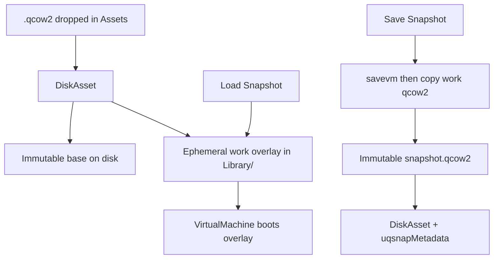
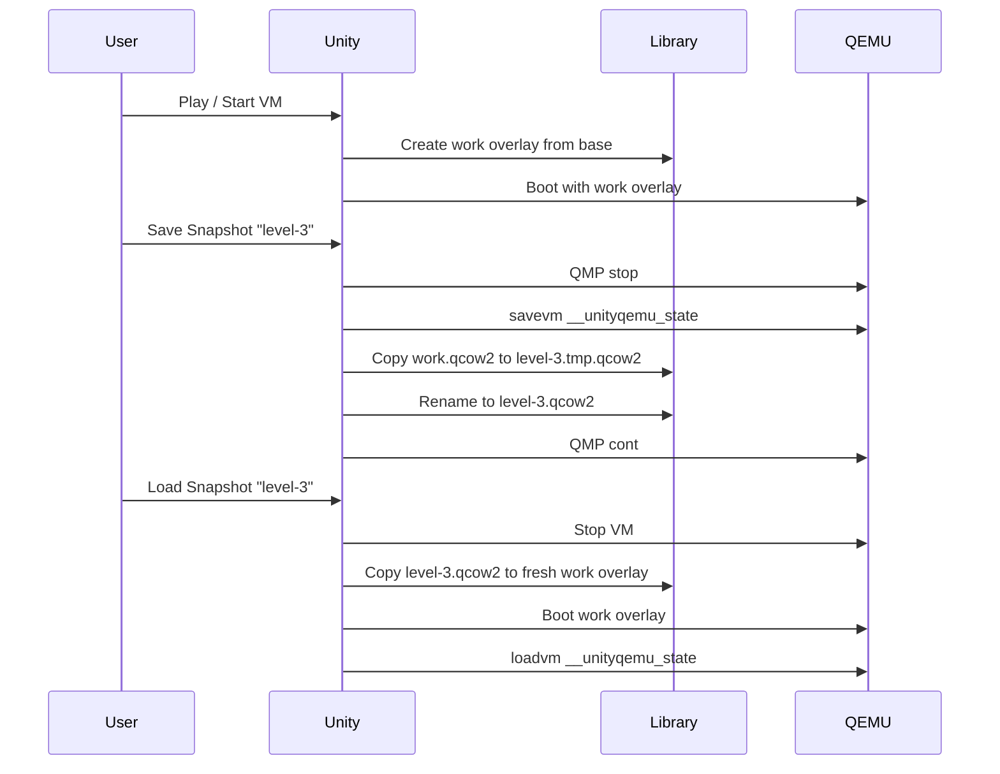

# QEMU Disk + Snapshot Design

Working design note for UnityQemu. Goal: hide overlay/snapshot complexity from users while making each saved state a robust, independent artifact.

---

## 1. Problem statement

### Current workflow

1. A **base** qcow2 (e.g. `win95.qcow2`) holds a clean guest install.
2. A **writable overlay** (e.g. `o1.qcow2`) is created with `qemu-img create -b base -F qcow2 overlay`.
3. QEMU boots with `-hda overlay`; guest writes go to the overlay only.
4. **Internal snapshots** (`savevm` / `loadvm`) are stored *inside* the active qcow2 via [LegacySnapshotUI.cs](../Runtime/Qemu/LegacySnapshotUI.cs).

This protects the base image from accidental writes, but introduces several problems:

| Problem | Detail |
|---|---|
| **Single point of failure** | All `savevm` tags live in the mutable overlay. If that qcow2 corrupts (which happens frequently in practice), every snapshot is lost at once. |
| **Unity asset churn** | qcow2 files under `Assets/` are watched by the editor. QEMU mutating them triggers reimport / Hot Reload noise even when the folder is gitignored. |
| **Leaky mental model** | Users must understand base vs overlay vs internal snapshot, manage paths manually ([bin/create-overlay.sh](../../../bin/create-overlay.sh)), and know that `savevm` is not a portable file. |
| **Two half-solutions** | [Assets/notes.txt](../../../Assets/notes.txt) records the tradeoff: `savevm` is fast but trapped in the disk; `migrate` is external but disk-agnostic and awkward to load at runtime. Neither alone gives "one file = full state." |

### Desired UX

- Drag-and-drop disk/snapshot assets in Unity.
- One user-visible artifact per snapshot (disk contents + CPU/RAM).
- Base image stays immutable.
- Corruption of the working disk must not destroy the snapshot library.
- Overlay mechanics hidden entirely.

---

## 2. QEMU primitives (cheat sheet)

| Mechanism | Disk state | CPU/RAM | Stored where | Load at runtime |
|---|---|---|---|---|
| **`savevm` / `loadvm`** | Yes (qcow2 internal snapshot) | Yes | Inside the active qcow2 file | Instant (`loadvm tag`) |
| **`migrate` to file** | No | Yes | External file (e.g. `save.state`) | Usually requires VM restart / `-incoming` |
| **qcow2 overlay** | Disk diffs only | No | Separate qcow2 backed by base | Boot with `-hda overlay` |
| **Full clone** (`qemu-img convert`) | Full disk copy | No | New qcow2 | Boot that image |
| **`-snapshot` flag** | Ephemeral (discarded on exit) | No | RAM-only overlay | N/A |

### Key constraints

- **`savevm` and qcow2 backing chains**: Internal snapshots are stored in the *topmost* writable image in the chain. They do not survive well across overlay commits or when the backing file changes underneath.
- **`savevm` and `-snapshot` mode**: Incompatible — internal snapshots cannot be created on ephemeral snapshot disks.
- **`migrate`**: Captures VM device state (CPU registers, RAM, timers) but **not** block-device contents. Loading a migrate file assumes the disk is already in the state it was when the migration was taken.
- **`qemu-img commit`**: Merges overlay diffs into the backing file. Destructive to the overlay's internal snapshot table if not handled carefully.

---

## 3. Approaches

### A. Status quo — persistent overlay + many `savevm` tags

```
base.qcow2  ←  work.qcow2  (contains savevm tags: "slot1", "slot2", …)
```

**How it works today.** Boot `work.qcow2`, save/load via HMP `savevm`/`loadvm`.

| Pros | Cons |
|---|---|
| Instant in-session load | One corrupt overlay = all snapshots gone |
| Already implemented ([LegacySnapshotUI.cs](../Runtime/Qemu/LegacySnapshotUI.cs)) | Snapshots not portable/extractable |
| Simple overlay protects base | Unity watches mutable qcow2 |
| | Mental model leaks to user |

---

### B. Ephemeral work overlay + commit-back

```
base.qcow2  ←  work-TIMESTAMP.qcow2  (fresh each run)
                     ↓ on explicit "Save"
              commit / promote → persistent overlay
```

**How it works.** Unity creates a fresh overlay at VM start. On explicit save, `qemu-img commit` merges diffs into a persistent layer (or replaces the previous work overlay).

| Pros | Cons |
|---|---|
| Base always protected | `qemu-img commit` + internal snapshots interact badly |
| Unsaved session loss is cheap (delete temp overlay) | Commit itself can corrupt if interrupted |
| | Still no one-file-per-snapshot |
| | Doesn't solve VM-state (RAM/CPU) persistence |
| | Commit is slow for large diffs |

**Verdict:** Better crash isolation for unsaved work, but does not solve the snapshot library problem and commit semantics are fragile.

---

### C. Overlay chain as timeline

```
base.qcow2  ←  snap1.qcow2  ←  snap2.qcow2  ←  work.qcow2
              (immutable)      (immutable)      (mutable)
```

**How it works.** Each named snapshot is a frozen qcow2 layer. Saving creates a new backing layer; the work overlay is always the tip. Loading rewires the chain to boot from a chosen layer.

| Pros | Cons |
|---|---|
| Disk history is explicit and inspectable | Chain grows without bound |
| Losing `work` only loses unsaved progress | Deep chains slow boot and complicate `qemu-img` ops |
| Each layer is independently copyable | VM state (RAM/CPU) still needs a separate mechanism |
| | Rebasing / flattening required periodically |
| | User still sees multiple qcow2 files unless heavily wrapped |

**Verdict:** Good disk-only versioning model (similar to Docker layers), but incomplete without a RAM-state companion and chain management adds ongoing complexity.

---

### D. Immutable snapshot packages via `migrate` (blocked)

```
                    ┌─────────────────────────────────┐
  base.qcow2        │  snapshot "level-3".uqsnap      │
  (immutable)       │  ├── disk.delta.qcow2           │
       ↑            │  ├── vm.state  (migrate)        │
       │            │  └── manifest.json              │
  work.qcow2        └─────────────────────────────────┘
```

**How it would work.** Ephemeral work overlay + package containing disk delta + `migrate` VM state. Load = rebuild overlay and start with `-incoming`.

**Blocked.** External migration restore has failed in practice on this project's QEMU builds:

- `-incoming "exec: cat save.state"` hit an internal QEMU error.
- File-based migration transports also failed (same class of problem).
- Suspected fix path was rebuilding QEMU from source — not desirable.
- A newer upstream QEMU release may fix this later; worth re-testing then, but do **not** depend on it for the prototype.

| Pros | Cons |
|---|---|
| Clean separation of disk delta + VM state | **Blocked:** `migrate`/`-incoming` unreliable here |
| Snapshots independent of work overlay | Would need VM restart on load |
| | Package orchestration more complex |

**Verdict:** Architecturally attractive, currently unusable until migration restore is proven on our QEMU.

---

### D2. Copied overlay packages with embedded `savevm` (recommended prototype)

```
  base.qcow2 (immutable, shared read-only)
       ↑
       ├── work-A.qcow2          ← session work (mutable)
       ├── work-B.qcow2          ← another VM session OK concurrently
       ├── level-3.qcow2         ← durable snapshot (immutable copy)
       └── boss-fight.qcow2      ← durable snapshot (immutable copy)
            each snapshot qcow2 contains one savevm tag: __unityqemu_state
```

**How it works.** Reuse the reliable `savevm` path, but isolate every durable snapshot into its own file so a corrupt work overlay cannot wipe the library.

1. **Boot:** Create (or reuse) a work overlay in `Library/UnityQemu/work/` backed by the immutable base. Never write to snapshot copies.
2. **Save durable snapshot:**
   - Pause guest (`stop`), or briefly stop QEMU if Windows cannot copy an open qcow2.
   - `savevm __unityqemu_state` into the work overlay.
   - Byte-copy work overlay → `snapshot.tmp.qcow2`, then atomic rename to the durable snapshot path.
   - Resume (or restart) the guest.
3. **Load durable snapshot:**
   - Stop QEMU.
   - Copy the snapshot qcow2 → fresh work overlay (never boot the snapshot file itself).
   - Start QEMU on the work copy, then `loadvm __unityqemu_state`.
4. **In-session quick slots (optional):** Extra `savevm` tags on the work overlay only; discarded with the session.

**Why this works without `migrate`:** `savevm` already stores disk + CPU/RAM inside the qcow2. Copying that qcow2 after `savevm` is effectively a portable package. The snapshot still **depends on the immutable base** (backing file) unless later flattened for export.

| Pros | Cons |
|---|---|
| Uses proven `savevm`/`loadvm` | Snapshot files still need the shared base (unless flattened) |
| One file ≈ one snapshot (from the user's POV) | Durable load needs VM restart + `loadvm` |
| Work corruption cannot destroy prior snapshots | Copying a large overlay can be slow / disk-heavy |
| No dependency on broken migration restore | Windows: may need to stop QEMU before file copy |
| Concurrent VMs can share one base (see §7) | |

**Verdict:** Best prototype given migration failures. Same UX goals as D, different storage mechanism.

---

### E. Full-image clone per snapshot

```
base.qcow2
snap1.qcow2   (full copy, ~200 MB – 2 GB)
snap2.qcow2   (full copy)
```

**How it works.** Each save runs `qemu-img convert` to produce a complete standalone qcow2, optionally paired with a migrate state file.

| Pros | Cons |
|---|---|
| Simplest mental model | Multi-GB per snapshot |
| Most robust (no backing chain) | Slow to create and copy |
| Easy to inspect with any qcow2 tool | Impractical for frequent saves |
| | Wasteful when diffs are small |

**Verdict:** Good for rare "golden master" checkpoints, poor as the default save mechanism.

---

## 4. Comparison matrix

| Criterion | A (status quo) | B (commit-back) | C (chain) | D (migrate pkgs) | D2 (savevm copies) | E (full clone) |
|---|---|---|---|---|---|---|
| One file per snapshot | No | No | Partial | Yes | **Yes** | Yes |
| Survives overlay corruption | No | Partial | Partial | Yes | **Yes** | Yes |
| Instant in-session load | **Yes** | Yes | Yes | No | No (restart) | No |
| Hides overlay complexity | No | Partial | Partial | Yes | **Yes** | Yes |
| Unity-safe (no reimport) | No | Partial | Partial | Yes | **Yes** | Yes |
| Works without migrate | Yes | Yes | Yes | **No (blocked)** | **Yes** | Yes |
| Implementation effort | Done | Medium | High | Medium | Medium | Low |
| Storage efficiency | Good | Good | Good | Good | Good (deltas) | Poor |

---

## 5. Unity asset layer

Pair **Approach D2** with a thin Unity asset wrapper so users interact with ScriptableObjects, not raw qcow2 files.



### DiskAsset

Main object of the custom `.qcow2` / `.uqsnap` importer (or "Create from file…" menu).

| Field | Purpose |
|---|---|
| `projectRelativeQcow2Path` | Path to the immutable image under Assets |
| `backingDisk` | Immediate parent `DiskAsset` (qcow2 backing file) |
| `uqsnapMetadata` / `hasUqsnapMetadata` | Set for `.uqsnap` (savevm + launch config); flag clear for plain disks |
| `label` / `note` | Display name and freeform annotation |

The image under Assets is **immutable** — QEMU only writes ephemeral Library work images.

### Runtime layout (D2)

```
Assets/
  qemu/disk/win95.qcow2           ← DiskAsset (uqsnapMetadata = null)
  qemu/Snapshots/level-3.uqsnap   ← DiskAsset (uqsnapMetadata set)

Library/UnityQemu/
  work/
    …-session.qcow2               ← ephemeral work image for one VirtualMachine
```

Mutable session data lives under `Library/`, which is gitignored and not reimported.

### Snapshot file format (D2 draft)

One qcow2 overlay copy is the package:

- Backing file = immutable base
- Contains internal snapshot tag `__unityqemu_state` (disk + CPU/RAM)
- Optional sidecar `level-3.json` for note / createdAt / parent disk hash (keeps metadata out of qcow2)

Write protocol: `savevm` → copy to `level-3.tmp.qcow2` → fsync → rename to `level-3.qcow2`. Never overwrite an existing snapshot in place.

*(If migration restore is later proven on a newer QEMU, an alternate `.uqsnap` layout with separate `vm.state` can be revisited — see Approach D.)*

---

## 6. Session lifecycle (Approach D2)



### In-session quick slots (optional)

For fast undo during a play session, extra `savevm`/`loadvm` tags can still target the ephemeral work overlay. These slots:

- Are **not** copied out as durable snapshot files.
- Are **lost** when the VM stops or the work overlay is deleted.
- Can reuse the existing [LegacySnapshotUI.cs](../Runtime/Qemu/LegacySnapshotUI.cs) with a clear "temporary" label in the inspector.

This gives instant in-session load without compromising durable snapshot isolation.

---

## 7. Concurrent VMs sharing one base

**Yes — two QEMU instances can run at once with separate overlays backed by the same base.**

Overlays open the backing file **read-only**. Each overlay has its own writable L1/refcount tables; guest writes never touch the base. So:

```
base.qcow2  (read-only, shared)
     ↑
     ├── work-A.qcow2  → qemu instance A
     └── work-B.qcow2  → qemu instance B
```

is the intended qcow2 design.

**Caveats:**

- Never `qemu-img commit` (or otherwise write) the shared base while either VM is running.
- Do not point two VMs at the *same* overlay file.
- Snapshot copies also share the base; keep the base immutable forever (or flatten before distributing a snapshot elsewhere).
- On Windows, watch for antivirus / file-lock quirks on the shared base; read-only opens are normally fine.

---

## 8. Open questions / later experiments

1. **VM restart on durable load** — Acceptable; in-session `savevm` covers fast undo. (Leaning yes.)
2. **Copy while paused vs stop** — Can Windows copy the work qcow2 while QEMU holds it open after `stop`? If not, durable save must briefly stop the process.
3. **Flatten-on-export** — Optional later for portable snapshots that don't need the base.
4. **In-session quick slots** — Recommend yes, clearly labeled "session only."
5. **Multiple disks** — Defer; extend snapshot sidecar metadata when needed.
6. **Re-test migrate on newer QEMU** — Bundled build is currently 10.1.0; when a newer release is tried, re-check file-based `-incoming`. If it works, Approach D becomes an alternative again. Until then, D2 only.
7. **Windows `memory-backend-file` shared RAM** — Separate concern (live memory reads without pause).

---

## 9. Recommendation

**Prototype Approach D2: copied overlay + embedded `savevm`, ephemeral work overlay.**

Do **not** implement yet — notes only. Revisit when ready to build Phase 1.

| Goal | How D2 achieves it |
|---|---|
| Hide overlay nastiness | Work overlay auto-managed in `Library/`; user never sees it |
| One file ≈ one snapshot | Snapshot qcow2 copy embeds `savevm` state |
| Survive corruption | Durable snapshots are immutable copies; work is disposable |
| Avoid broken migrate | Uses only `savevm`/`loadvm` |
| Unity drag-and-drop | `DiskAsset` (plain or `.uqsnap`) is a thin ScriptableObject |
| Shared bases | Multiple VMs / overlays can read the same immutable base |

### Implementation phases (future work — not started)

1. **Phase 1 — Disk asset wrapper:** `DiskAsset`, custom importer, auto work-overlay in `Library/`, wire into [VirtualMachine.cs](../Runtime/Qemu/VirtualMachine.cs).
2. **Phase 2 — Durable save:** Pause → `savevm` → atomic copy of work overlay to snapshot path.
3. **Phase 3 — Durable load:** Copy snapshot → work overlay → restart VM → `loadvm`.
4. **Phase 4 — Snapshot UI:** durable save/load via [SnapshotUI.cs](../Runtime/Qemu/SnapshotUI.cs); keep HMP list in [LegacySnapshotUI.cs](../Runtime/Qemu/LegacySnapshotUI.cs).
5. **Phase 5 — Polish:** Quick slots, flatten-on-export, multi-disk, size optimization.
6. **Optional later:** Re-test Approach D (`migrate`) on a newer QEMU; keep D2 as the default if migrate remains unreliable.

---

## 10. References

- [QEMU internal snapshots (savevm)](https://wiki.qemu.org/Documentation/CreateSnapshot)
- [QEMU live migration](https://www.qemu.org/docs/master/devel/migration/index.html) — blocked for restore; see Approach D notes
- [qemu-img commit](https://www.qemu.org/docs/master/tools/qemu-img.html)
- Project notes: [Assets/notes.txt](../../../Assets/notes.txt)
- Overlay script: [bin/create-overlay.sh](../../../bin/create-overlay.sh)
